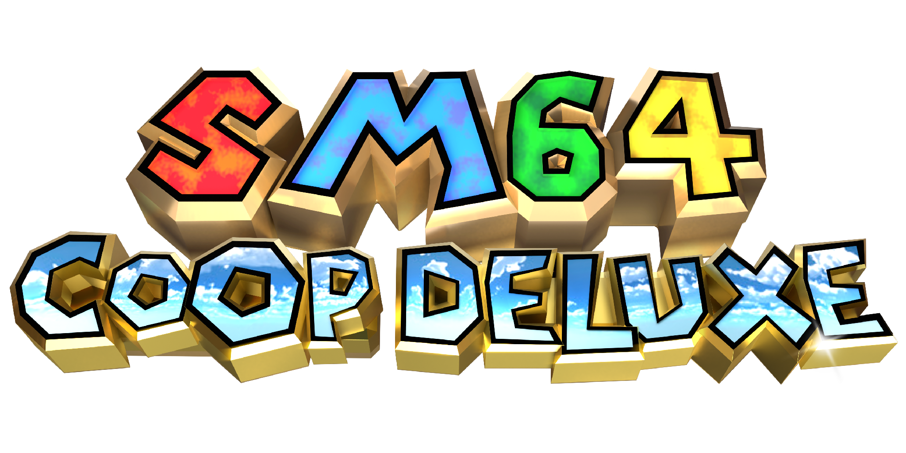

sm64coopdx is an online multiplayer project for the Super Mario 64 PC port that synchronizes all entities and every level for multiple players. The project was started by the Coop Deluxe Team. The purpose is to actively maintain and improve, but also continue sm64ex-coop, created by djoslin0. More features, customization, and power to the Lua API allow modders and players to enjoy Super Mario 64 more than ever!

Feel free to report bugs or contribute to the project. 

## Initial Goal (Accomplished)
Create a mod for the PC port where multiple people can play together online.

Unlike previous multiplayer projects, this one synchronizes enemies and events. This allows players to interact with the same world at the same time.

Interestingly enough though, the goal of the project has slowly evolved over time from simply just making a Super Mario 64 multiplayer mod to constantly maintaining and improving the project (notably the Lua API.)

## Lua
sm64coopdx is moddable via Lua, similar to Roblox and Garry's Mod's Lua APIs. To get started, click [here](docs/lua/lua.md) to see the Lua documentation.

# sm64rt

Fork of [sm64pc/sm64ex](https://github.com/sm64pc/sm64ex) that adds support for [RT64](https://github.com/DarioSamo/RT64), a hardware-accelerated real-time path tracer.

## Alpha Phase

**At the moment, this mod is currently in its alpha phase and should only be used by those willing to tolerate issues such as visual glitches and performance problems**. This project is subject to have major changes in the future in anything from its architecture, design, aesthetic and performance. Any help towards solving these issues is welcome.

Please do not report issues that don't provide new information. Remember to check if your problem has already been reported on the [issue tracker](https://github.com/DarioSamo/sm64rt/issues).

Performance is highly dependent on the target resolution and it still has plenty of room for improvement. Using upscalers like NVIDIA DLSS will help significantly in achieving higher framerates. If you cannot reach the target framerate, it's recommended to lower the resolution with the internal scaler or select a lower quality DLSS preset, as it has the biggest impact in performance out of all the options.

## Requirements
* Windows 10 (2004 or newer)
* [Microsoft Visual C++ Redistributable for Visual Studio 2019](https://aka.ms/vs/16/release/vc_redist.x64.exe)
* GPU with DXR support (NVIDIA Drivers version 470 or newer **required** for DLSS support)
  - Unsure if you can run the mod? [Download and run the RT64 sample instead!](https://github.com/DarioSamo/RT64/releases/download/test-sample-v1/rt64sample-v1.zip)

## Features
* Fully path-traced renderer.
* Custom level lighting for all stages.
* Dynamic sphere lights for objects and particles.
* Classic Phong shading.
* Custom material properties based on texture names or geometry layouts.
* Normal map support.
* Real-time raytraced shadows, reflections, refractions and global illumination.
* Real-time denoiser (experimental).
* NVIDIA DLSS (Deep Learning Super Sampling).

## Building
For building instructions, please refer to the [sm64ex wiki](https://github.com/sm64pc/sm64ex/wiki) and follow the process as normal with these additional build flags:

* RENDER_API=RT64 (Required to use RT64 as the renderer)

* EXTERNAL_DATA=1 (Required for associating textures to the renderer's material properties)

The repository already comes with a prebuilt binary and the compatible header file for RT64 to make the build process easier. If you wish to build this module yourself, you can do it from the [RT64 repository](https://github.com/DarioSamo/RT64) instead.

## Render96 Support
A native version of sm64rt is currently integrated into Render96ex. You don't need to build this repository to access it.
